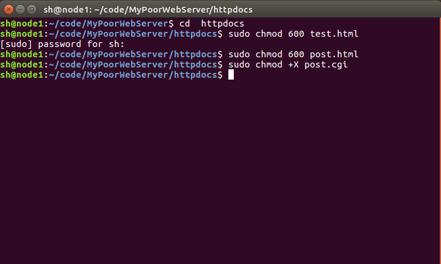
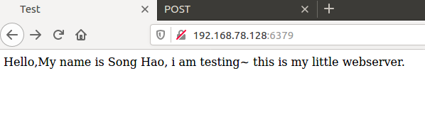
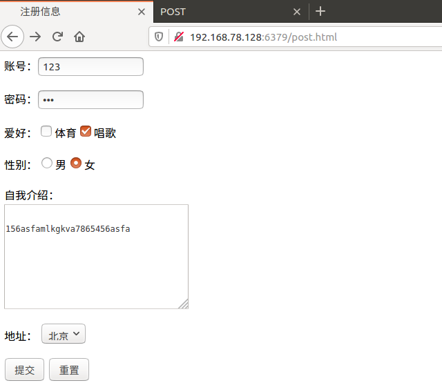
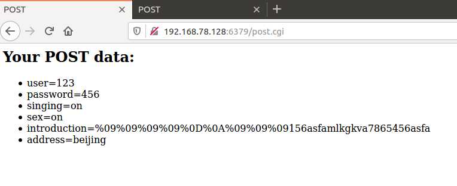
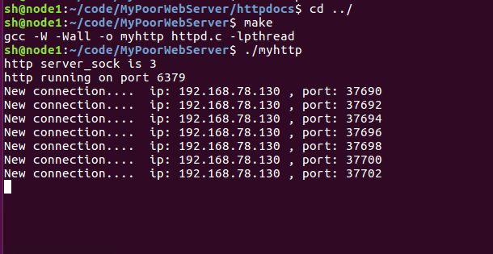
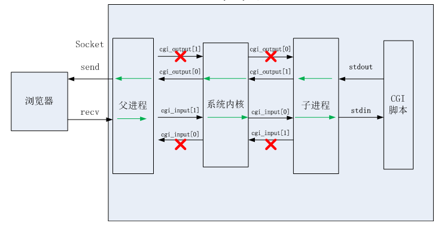

<h3 align="center">一款可运行的基于C++11 实现的HTTP服务器</h3>

### 

#### 1、由来

该项目是基于C++ 实现的HTTP服务器，也就是那种烂大街的WebServe服务器，不过由于是自己动手做的，所以还是很有意义的就上传上来了 

### 2、编译

请严格按照下面步骤进行编译

#### 1、编译准备工作

文件夹中的 post.html 以及 post.cgi 文件需要一定的权限才可以执行。

所以需要先进行权限给予。

第一步、克隆项目并给予足够权限，打开命令行依次输入下述命令：

```c
git clone  https://github.com/forthespada/MyPoorWebServer

cd  httpdocs

sudo chmod 600 test.html

sudo chmod 600 post.html

sudo chmod +X post.cgi
```

在进行sudo命令时，需要输入Linux下的sudo命令。

如下图所示：



如果忘记自己设置的sudo密码，可以按照如下教程进行密码重置：[sudo密码重置](https://blog.csdn.net/TravisPan/article/details/88682529?utm_medium=distribute.pc_aggpage_search_result.none-task-blog-2~aggregatepage~first_rank_v2~rank_aggregation-1-88682529.pc_agg_rank_aggregation&utm_term=linux%E5%BF%98%E8%AE%B0sudo%E5%AF%86%E7%A0%81&spm=1000.2123.3001.4430)

#### 2、编译执行

依次输入下述命令即可。

```c
cd  ../

make

./myhttp
```

#### 3、整体过程图

1、项目默认端口号是6379，如像下图地址栏所示，默认显示的界面是是test.html界面。

2、运行成功后默认显示的为test.html界面，同时同一路径下还有 post.html界面，可以将地址栏的“**test.html**”改成“**post.html**”来进行查看。









#### 4、整体框架图



#### 6、参考资料

《TCPIP网络编程》-韩国-尹圣雨

《Linux高性能服务器编程》-中国-游双

https://www.cnblogs.com/qiyeboy/p/6296387.html

https://www.jianshu.com/p/18cfd6019296
